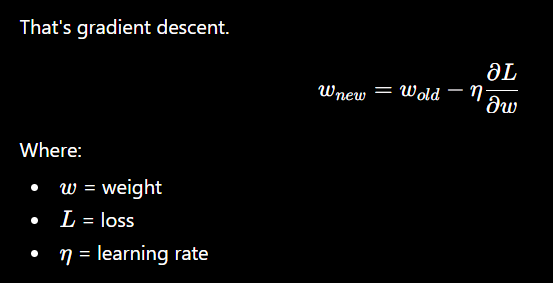

# Deep Learning Interview Questions with Examples

# **Foundation/Basics**

## Q1:What is Deep Learning, and how is it different from Machine Learning?

Ans: Deep learning is a subset of Machine Learning which uses neural networks with multiple hidden layers to learn representations directly from data.

Traditional ML requires us to tell model that which features matter. Deep learning tries to learn those features itself.

Examples:

For image classification: 

- ML: manually extract edges, shapes, features → classifier
    - We typically perform feature engineering ourselves. For an image we might manually calculate the features such as edges, textures, color and give those features to model like Random Forest or SVM.
- DL: you give images to CNN→ network learn edges→ shapes→ objects
    - We give the raw image to CNN and during training phase it learns the useful pattern representations automatically such as edges, textures, shapes and uses them to classify the image.

## Q2: You said that Deep learning learns itself? So is this a magic or something. Explain.

Ans: - Imagine we have 3 images like cat, cat, dog. Initially CNN knows nothing about cats or dogs.

- Step 1: Giving the cat image to the network.
    - The image will be converted into pixel values. (numbers)
    - The CNN processes those numbers through its layers.
    - At the beginning it hasn’t learned anything so CNN might predict DOG as ans.
- Step 2: Calculate how wrong it was.
    - We use a loss function which tells us how much wrong was the ans.
- Step 3: Backpropagation asks what caused this mistake?
    - The network contains **millions of weights**.
    - For example, conceptually:
        - pixel → weight → neuron → weight → neuron → prediction
        - Backpropagation calculates:
            - "How much did each weight contribute to the error?
            - Mathematically, it calculates gradients.
            - Weight A → contributed a lot to error
            - Weight B → contributed a little
            - Weight C → contributed almost nothing
- Step 4: The optimizer changes the weights. Now the optimizer, such as gradient descent, says: "Okay, let's change those weights slightly so that next time the prediction is better."
- Step 5: Repeat it thousands/ millions times.

Basically A neural network learn by adjusting the weights based on its errors. It first makes a prediction, calculate the loss and uses backpropagation to calculate gradients. An optimiser uses gradients to update those weights and repeating this process million times and help to give accurate predictions.

## Q3: What is neural Network?

Ans:  Neural network is an artificial computation model made of interconnected neurons that have lot of resemblance to the biological neural network in the human body. Each neuron takes input applies weights and bias and passes through activation function and produces an output.

## Q4 What does a neuron actually calculate?

Ans: Neuron basically does **three things**:

> **Take inputs → calculate weighted sum → apply activation function**
> 

## Q5. Why do we need hidden layers?

First understand what happens without hidden layers:

- Without Hidden layer the network can learn a relatively simple relationship between inputs and outputs.
- But the real world problems are much more complicated

So Hidden layers allow network to learn intermediate and increasingly complex representation of inputs.

For example: image recognition early layers can learn simple patterns like edges, while deeper layers can combine them into shapes and object level features. Together with non linear activation function, hidden layer allows neural networks to model complex relationship.

## Q6. What are weights and biases?

Ans. 

- A **weight determines how strongly an input influences a neuron. Initialized by framework like Pytorch or Tensorflow.**
- Bias is an additional parameter that allows the neuron to **shift its activation/decision**

# Level 2- Medium/ Intermediate Questions

## Q7. What is loss functions?

Ans: Loss functions measures how the model’s prediction is different from the actual target.

## Q8. What is an activation function and why do we need it?

Ans. 

- An activation function introduces the non linearity to the neural network. Without it multiple linear layers would produce a linear transformation regardless of number of layers.
- In a CNN, a filter looks for a pattern such as an edge and produces a score. The activation function then transforms that score. For example, ReLU keeps positive values and changes negative values to zero. This helps the network focus on useful signals and learn complex patterns from simple ones.
- Without activation functions, multiple neural-network layers would behave essentially like one linear layer, so the network couldn't learn complex non-linear patterns.

## Q9. Explain ReLU. Why is it so popular?

Ans: ReLU(x)=max(0,x)

- ReLU basically says: negative information gets zeroed out, positive information passes through.
- It simple in computation.
- It introduces non linearity to the model and helps them to learn complex patterns.
- Usually gives better gradient than sigmoid or tanh.

## Q10. Sigmoid Activation?

Ans: Sigmoid maps values between 0 and 1, so it's useful when we want a probability-like output, especially for binary classification.

## Q11: Explain all activation functions why one lead to another why not only one activation function is required?

Ans. Think of the evolution like this:

**Sigmoid → Tanh → ReLU → Leaky ReLU**

- Sigmoid: convert the signal into 0 or 1.

| Input | Tanh output |
| --- | --- |
| -5 | 0.01 |
| -2 | 0.12 |
| 0 | 0.5 |
| 2 | 0.88 |
| 5 | 0.99 |
- Problem with Sigmoid: Look at the ends:
    - Very negative → 0
    - Very positive → 1
- When sigmoid gets close to **0 or 1**, its gradient becomes **very small**.
- That creates the: **Vanishing Gradient Problem**
- Imagine you're passing a message backward through 20 people. At every person, the message gets quieter:

```
Person 20 → 🔊
Person 19 → 🔉
Person 18 → 🔈
Person 17 → ...
Person 1  → almost nothing
```

- The earlier layers receive almost no useful signal telling them how to improve. So deep networks can become difficult to train.

**Tanh** = looks similar to sigmoid but its output is -1 to +1

| Input | Tanh output |
| --- | --- |
| -5 | -1 |
| -2 | -0.96 |
| 0 | 0 |
| 2 | 0.96 |
| 5 | 1 |
- Sigmoid outputs are always positive while tanh is centered around 0.
- But tanh still saturated around -1 and +1
- Therefore Tanh can suffer from vanishing gradient.
- So we need still something better.

**ReLu**:  Let's make the hidden layers easier to train

| Input | Tanh output |
| --- | --- |
| -5 | 0 |
| -2 | 0 |
| 0 | 0 |
| 2 | 2 |
| 5 | 1 |

Why did it become popular? - Relu doesn’t squash the signal towards a maximum like sigmoid/tanh. 

| Input (Sigmoid) | Tanh output |
| --- | --- |
| 2 | 0.88 |
| 5 | 0.99 |
| 12 | 0.9989 ~ 1 |

| Input (ReLu) | output |
| --- | --- |
| -5 | 0 |
| 2 | 2 |
| 10 | 10 |

But Relu has a problem too as relu completely kills the negative values.

- If a neuron is consistently getting negative inputs it can become stuck and will be giving output as ZERO- and this is called DYING RELU
- And here comes Leaky Relu to solve the dying relu problem.

**Leaky Relu:** 
Instead of completely killing negative values, Leaky ReLU lets a **small amount** through.

Normal ReLU:

- 5 → 0
-2 → 0
2 → 2

Leaky ReLU:

- 5 → small negative value
-2 → small negative value
2 → 2
- 5 → -0.05
-2 → -0.02
2 → 2

Here is the full picture:

| Activation | Formula | Range | Why use it? | Main Problem | Typical Use |
| --- | --- | --- | --- | --- | --- |
| **Sigmoid** | `1 / (1 + e^-x)` | 0 to 1 | Gives probability-like output | Vanishing gradients | Binary classification output |
| **Tanh** | `(e^x - e^-x) / (e^x + e^-x)` | -1 to +1 | Zero-centered output | Vanishing gradients | Older RNNs / some hidden layers |
| **ReLU** | `max(0, x)` | 0 to ∞ | Simple + good gradient flow for positive values | Dying ReLU | Most hidden layers |
| **Leaky ReLU** | `max(αx, x)` | -∞ to ∞ | Keeps a small gradient for negative values | Adds α hyperparameter | Alternative to ReLU |
| **Softmax** | `e^zi / Σe^zj` | 0 to 1 | Converts scores into probabilities that sum to 1 | Can become very sharp/saturated | Multiclass classification output |

# Level 3: Advanced Questions

## Q 12. What is forward propagation?

Ans. Forward propagation is the process of passing the input through each layer of the network, calculating activations until we obtain the final prediction.

## Q13. What is Backpropagation?

Ans. It is an algorithm used to calculate how much each model parameter contributed to the error by propagating the error backward through network using chain rule.

It sends error information from the network's last layer to all of the weights within the network which helps in lowering your error rates.

Example: Backpropagation starts at the output error, calculates its derivative with respect to the output activation, propagates these derivatives backward through each hidden layer using the chain rule, calculates the derivative of the error with respect to each weight, and uses those derivatives to update the weights.

Output error → calculate derivatives → propagate derivatives backward → calculate weight derivatives → update weights.

## Q14. What is Gradient Descent?

Ans. Gradient Descent is an optimisation technique to update the model parameters in the direction that reduces the loss.



## Q15. What is types of Gradient Descent

1. **Batch Gradient Descent:** Uses the entire training dataset to calculate the gradient for one update.
2. **Stochastic Gradient Descent (SGD):** It choses random instance of training data and then computes gradient which is faster than Batch Gradient.
- **Drawback of SGD:** it can bounce around the minimum value instead of settling there.


1. **Mini Batch Gradient Descent:** Uses a small batch of examples used in deep learning.

## Q16. Why is mini-batch gradient descent commonly preferred in deep learning?

Ans: 

1. Computationally efficient
2. memory usage
3. stable gradients

## Q17. What is Saddle Point?

Ans. A point where gradient is close to zero but point is not actually a minimum.

## Q18. What is the learning rate?

Ans. The learning rate controls **how big a step the optimizer takes** during parameter updates.

## Q19. How do you chose Learning rate?

Ans. We start with a reasonable value, monitor the training/validation loss, and adjust it: if training is unstable or the loss jumps, the learning rate may be too high; if learning is extremely slow, it may be too low.

## **Q20. What is an epoch, batch, and iteration?**

Ans.

1. **Batch** is a small group of training examples processed together in one step.
1 batch = 100 images → So your 1,000 images are divided into:
    
    Batch 1 → 100 images
    Batch 2 → 100 images
    Batch 3 → 100 images
    ...
    Batch 10 → 100 images
    
2. I**teration** is one time the model processes a batch and performs a weight update.
3. An **epoch** means the model has gone through the **entire training dataset once**.

Epoch 1
├── Batch 1 → Update
├── Batch 2 → Update
├── ...
└── Batch 10 → Update

= 1 complete pass through 1,000 images. 
If you train for **5 epochs**, the model sees those 1,000 images **5 times**.

## Q21. What is CNN?

Ans. CNN is a neural network designed to learn spatial patterns like images. 

Architecture of CNN:

Input image → Convolution layer → ReLu → Pooling → More Conv+ ReLu+Pooling → Flatten → FC layer→ Output

1. Conv Layer: small filter, kernel slides over image and detect the patterns like edges, curves, lines etc
2. ReLu: It introduces non linearity allowing network to learn about complex pattern
3. Pooling: basically reduces the size. Pooling reduces the spatial dimension while trying to retain important information. Instead of keeping every detail we keep the strongest (max pool)
4. Flatten: After all this we have a feature map which is a standard neural network so we convert this into a one long vector.

## Q22. What is convolution?

Ans: A small filter or kernel which slides across image and perform mathematical element wise multiplication.

## Q23. What are stride and padding?

**Stride:** how many pixels the filter moves at each step.

**Padding:** adding pixels around the image, usually zeros, to control output size and preserve edge information.

#